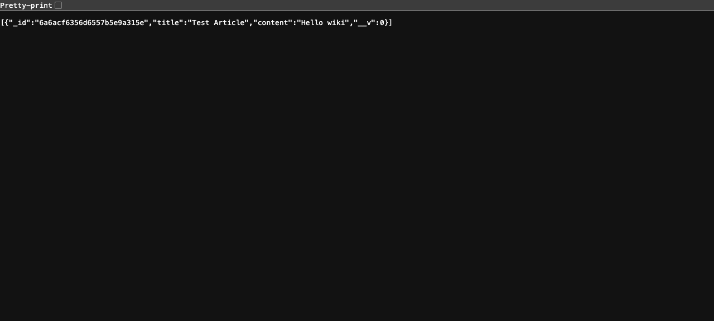

# Wiki API

A small RESTful API for wiki articles (GET, POST, PUT, PATCH, DELETE), built with Express and Mongoose.

## Stack

- Node.js, Express, Mongoose, EJS
- MongoDB

## Run it

Requires a local MongoDB instance. By default it connects to `mongodb://localhost:27017/wikiDB`;
override with a `MONGODB_URI` env var if you're running Mongo elsewhere. `PORT` is also
configurable and defaults to `3000`.

```
npm install
node app.js
```

Server starts on `http://localhost:3000` (or whatever `PORT` you set).

## Screenshot



## License

MIT — see [LICENSE](LICENSE).
